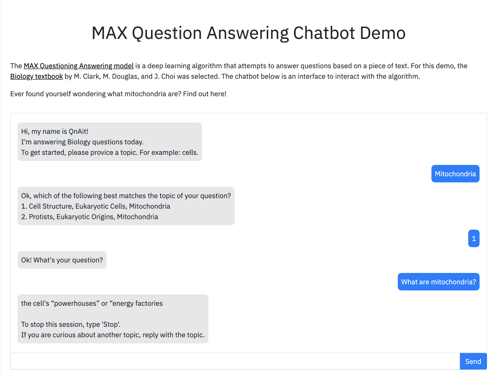

[](http://max-question-answering.max.us-south.containers.appdomain.cloud/) [](http://max-question-answering-web-app.max.us-south.containers.appdomain.cloud/)

# Create a machine learning powered web app to answer questions

Ever found yourself wondering what mitochondria are? Perhaps you are curious about how neurons communicate with each other? A Google search works well to answer your questions, but how about something still digestible, but more precise? This code pattern will show you how to build a chatbot that will answer questions found in a college biology textbook. In this pattern, the textbook used is [Biology 2e](https://books.google.com/books/about/Biology_2e.html?id=JLPQtwEACAAJ) by Mary Ann Clark, Matthew Douglas, and Jung Choi. 

The web app uses the [Model Asset eXchange (MAX) Question Answering Model](https://github.com/IBM/MAX-Question-Answering) to answer questions that are typed in by the user. The web application provides a chat-like interface that allows users to type in questions that are sent to a Flask python server. The backend then sends the question and related body of text from the textbook to a REST end point exposed by the MAX model which returns an answer to the question, displayed as a response from the chatbot. The model's REST endpoint is set up using the docker image
provided on MAX.

When the reader has completed this Code Pattern, they will understand how to:

* Build a Docker image of the Model Asset eXchange (MAX) Question Answering model
* Deploy a deep learning model with a REST endpoint
* Generate answers to questions using the MAX Model's REST API
* Run a web application that using the model's REST API

## Flow

1. User interacts with Web UI and asks questions until the query is narrow enough to select text from the textbook.
2. Web UI requests answers from Server and updates chat when data is returned.
3. Server sends question and body of text to Model API and receives answer data.



## Included Components

* [IBM Model Asset Exchange](https://developer.ibm.com/exchanges/models/): A place for developers to find and use
free and open source deep learning models.
* [Docker](https://www.docker.com): Docker is a tool designed to make it easier to create, deploy, and run applications
by using containers.

## Featured Technologies

* [Python](https://www.python.org/): Python is a programming language that lets you work more quickly and integrate
your systems more effectively.
* [JQuery](https://jquery.com): jQuery is a cross-platform JavaScript library designed to simplify the client-side
scripting of HTML.
* [Bootstrap 3](https://getbootstrap.com): Bootstrap is a free and open-source front-end library for designing websites
and web applications.
* [Flask](https://palletsprojects.com/p/flask/): A lightweight Python web application framework.

# Steps

## Run Locally

**Start the Model API**

1. [Deploy the Model](#deploy-the-model)
2. [Experiment with Model API (optional)](#experiment-with-model-api-optional)

**Build the Web App**

1. [Clone the repository](#clone-the-repository)
2. [Install dependencies](#install-dependencies)
3. [Start the server](#start-the-server)
4. [Configure ports (Optional)](#configure-ports-optional)
5. [Instructions for Docker (Optional)](#instructions-for-docker-optional)

### Start the Model API

#### Deploy the Model

To run the docker image, which automatically starts the model serving API, run:

```
$ docker run -it -p 5000:5000 codait/max-question-answering
```

This will pull a pre-built image from Docker Hub (or use an existing image if already cached locally) and run it.
If you'd rather build and run the model locally, or deploy on a Kubernetes cluster, you can follow the steps in the
[model README](https://github.ibm.com/CODAIT/MAX-Question-Answering#steps)

#### Experiment with Model API (optional)

The API server automatically generates an interactive Swagger documentation page.
Go to `http://localhost:5000` to load it. From there you can explore the API and also create test requests.

Use the `model/predict` endpoint to enter in text data and get answers from the model.

The [model samples folder](https://github.ibm.com/CODAIT/MAX-Question-Answering/tree/master/samples)
contains samples you can use to test out the API, or you can use your own.

You can also test it on the command line, for example:

```
$ curl -X POST "http://localhost:5000/model/predict" -H "accept: application/json" -H "Content-Type: application/json" -d "{\"paragraphs\": [{ \"context\": \"John lives in Brussels and works for the EU\", \"questions\": [\"Where does John Live?\",\"What does John do?\",\"What is his name?\" ]},{ \"context\": \"Jane lives in Paris and works for the UN\", \"questions\": [\"Where does Jane Live?\",\"What does Jane do?\" ]}]}"
```

### Build the Web App

#### Clone the repository

Clone the web app repository locally. In a terminal, run the following command:

```
$ git clone https://github.com/IBM/MAX-Question-Answering-Web-App.git
```

Change directory into the repository base folder:

```
$ cd MAX-Question-Answering-Web-App
```

#### Install dependencies

Before running this web app you must install its dependencies:

```
$ pip install -r requirements.txt
```

#### Start the server

You then start the web app by running:

```
$ python app.py
```

You can then access the web app at: [`http://localhost:8000`](http://localhost:8000)

#### Configure ports (Optional)

If you want to use a different port or are running the model API at a different location you can change them with command-line options:

```
$ python app.py --port=[new port] --model=[endpoint url including protocol and port]
```

#### Instructions for Docker (Optional)

To run the web app with Docker the containers running the web server and the REST endpoint need to share the same
network stack. This is done in the following steps:

Modify the command that runs the MAX Question Answering REST endpoint to map an additional port in the container to a
port on the host machine. In the example below it is mapped to port `8000` on the host but other ports can also be used.

    docker run -it -p 5000:5000 -p 8000:8000 --name max-question-answering codait/max-question-answering
    
Build the web app image by running:

    docker build -t max-question-answering-web-app .

Run the web app container using:

    docker run --net='container:max-question-answering' -it max-question-answering-web-app

# Links

* [Model Asset eXchange (MAX)](https://developer.ibm.com/code/exchanges/models/)
* [Center for Open-Source Data & AI Technologies (CODAIT)](https://developer.ibm.com/code/open/centers/codait/)

# License

[Web app license](LICENSE)
[Textbook license](https://creativecommons.org/licenses/by/4.0/)
